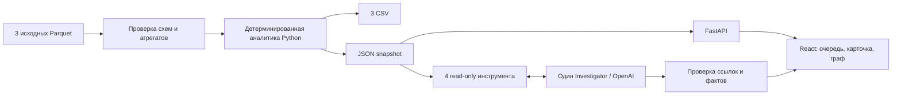

# HackAlem — объяснимая очередь проверки финансовой сети

**Кого проверить первым, почему и какие связи это подтверждают?** HackAlem помогает AML-аналитику ответить на эти вопросы по предоставленной транзакционной сети: от исходных Parquet до ранжированного списка, карточки с числовыми основаниями и направленного графа.

Приоритет означает порядок дальнейшей проверки. Роли — гипотезы о функции узла в наблюдаемой сети. Ни один из этих показателей не является вероятностью преступления.

[Быстрый запуск](#7-установка-и-запуск) · [Сценарий для жюри](#8-как-проверить-решение) · [Готовые CSV](submission/) · [Проверки ядра](integration/FINAL_GATE.md) · [Проверки нового UI](integration/FINAL_UX_INTEGRATION.md)

## 1. Название проекта

**HackAlem — объяснимая очередь проверки финансовой сети.** Решение кейса «Граф денег: восстановление финансовой структуры организованной группы по транзакционной сети».

## 2. Проблема и пользователи

Большой список переводов сам по себе не объясняет, с какого участника начинать исследование. Аналитику нужно сопоставить входящие и исходящие связи, связи с исходными участниками, положение в сети и ограничения выборки.

HackAlem собирает эти признаки в проверяемую очередь. Для каждого узла доступны основания роли и приоритета, наблюдаемые переводы, связи и следующий запрос недостающих данных. Это прототип поддержки аналитического исследования; решения о клиентах он не принимает.

## 3. Что реализовано

| Возможность | Что получает пользователь |
|---|---|
| Полный расчёт исходного кейса | Три Parquet → три CSV и единый JSON snapshot без API key |
| Роли и приоритеты | Все 2248 узлов, включая 19 изолированных seed; основная роль, вторичные признаки, раздельные оценки роли и приоритета |
| Объяснения | Шесть числовых вкладов в приоритет, исходные метрики, ссылки на evidence и ограничения каждого профиля |
| Кластеры | 105 рассчитанных сообществ, их состав в результатах, агрегаты и шаблонные гипотезы |
| Рабочий экран | Очередь, фильтры, поиск полного GID по всей выборке, карточка «Почему этот узел», направленный граф |
| Исследование окружения | Выбор узла, стрелки, легенда, граница depth=4, счётчики скрытых соседей и расширение подграфа |
| Экспорт | Скачивание `nodes_roles.csv`, `clusters.csv`, `top_nodes.csv` из интерфейса |
| Опциональный Investigator | Вопрос по всей сети или выбранному узлу; факты, ссылки на GID, переход из ответа в граф и реальные вызовы инструментов |
| Работа без AI | При отсутствии ключа, ошибке или таймауте модели аналитика, поиск, карточки, граф и CSV продолжают работать |

На проверенном Windows-окружении полный pipeline занял **3,339 с**, повтор — **3,073 с**; все четыре выходных файла совпали побайтово. Проверка чистого Git checkout заняла **3,250 с** и воспроизвела те же результаты. Это измерения на текущем наборе, не обещание производительности для произвольной сети.

## 4. Как работает решение

1. Пользователь передаёт папку с `nodes.parquet`, `edges.parquet`, `transactions.parquet`.
2. Pipeline проверяет схемы, идентификаторы, суммы переводов и количества операций. Повторяющиеся строки transactions без transaction_id сохраняются.
3. Python строит граф всех узлов, рассчитывает признаки, роли, сообщества и приоритеты по общим правилам.
4. Результаты сохраняются в CSV и snapshot. API и интерфейс используют этот же расчёт; клики не запускают аналитику заново.
5. Аналитик выбирает узел из очереди или находит произвольный GID, изучает основания и направленные связи. Ограниченный подграф не меняет метрики карточки.
6. При наличии ключа Investigator уточняет исследование через ограниченные read-only инструменты. Из его вывода можно перейти к соответствующему узлу и проверить факты.

### Откуда берутся роли и баллы

Правила версии `v0` реализованы в [pipeline/config.py](pipeline/config.py) и [pipeline/run.py](pipeline/run.py). Нет отдельных правил для демонстрационных GID.

| Роль | Основные условия допуска |
|---|---|
| `consolidator` — консолидация | Не менее 3 разных отправителей |
| `distributor` — распределение | Не менее 10 разных получателей |
| `transit` — гипотеза транзита | Вход и выход >0; ≥2 операций с каждой стороны; наблюдаемый out/in от 0,8 до 1,2; не seed, depth<4 |
| `terminal` — гипотеза конечного получателя | Не seed, depth<4; вход >0; out/in≤0,1; входящие на ≥2 датах; последний вход не позднее 29 июля |
| `coordinator` — структурный посредник, кандидат | Входящие и исходящие связи; достижимость от ≥2 seed; betweenness≥90-го квантиля положительных значений; межкластерный объём≥20% |
| `peripheral` — недостаточно признаков роли | Ни одна из ролей не прошла условия допуска |

Для допустимых ролей сила сигнала умножается на эвристический коэффициент: 0,85 для consolidator/distributor, 0,60 для transit, 0,50 для terminal, 0,55 для coordinator. Основная роль выбирается по максимальному score; равенства разрешаются фиксированным порядком из конфигурации. При одной операции score ограничен 0,40; fallback — 0,15, для изолята — 0,05. Другие допустимые роли сохраняются как вторичные.

Приоритет считается отдельно:

```text
priority = 0.175 × p(прямые seed-отправители)
         + 0.175 × p(достижимость от seed за ≤4 шага)
         + 0.250 × p(число отправителей)
         + 0.200 × p(max(наблюдаемый вход, наблюдаемый выход))
         + 0.100 × p(betweenness)
         + 0.100 × p(число получателей)
```

`p(x)` — positive midrank по положительным значениям признака во всей сети: `(число меньших + 0.5 × число равных) / N`; нули получают 0. Шесть вкладов сохраняются как evidence и доступны для сверки в карточке. Веса — прозрачная политика MVP; их оптимальность на размеченных данных не установлена. Подробности: [решения о методике](docs/DECISIONS.md), [BUILD_BRIEF](docs/BUILD_BRIEF.md).

## 5. Технологии

| Слой | Используется в репозитории |
|---|---|
| Аналитика | Python, pandas, NumPy, PyArrow, NetworkX; направленная невзвешенная betweenness, Louvain с seed=42 |
| Backend | FastAPI, Pydantic, Uvicorn; HTTP JSON API над snapshot |
| Интерфейс | TypeScript, React, Vite, Cytoscape.js |
| AI | OpenAI Python SDK, Responses API; модель по умолчанию `gpt-5.6-luna`, настройка через `OPENAI_MODEL` |
| Проверки | Python unittest, проверки реальных Parquet и контрактов, TypeScript/Vite build, браузерные сценарии |
| Хранение | Исходные Parquet, CSV и JSON snapshot; данные API в памяти процесса |

Зафиксированные Python-зависимости: [requirements-lock.txt](requirements-lock.txt). Frontend-зависимости: [package.json](frontend/package.json) и [package-lock.json](frontend/package-lock.json). Реальные AI-сценарии проверены с `gpt-5.6-luna`; доступ к модели зависит от настроек аккаунта OpenAI.

## 6. Архитектура проекта



| Каталог | Назначение |
|---|---|
| `case/` | Официальное задание и исходные данные |
| `pipeline/` | Проверка входов, признаки, роли, кластеры, CSV и snapshot |
| `backend/` | API, экспорт, загрузка snapshot, вызов Investigator |
| `frontend/` | Единый аналитический экран |
| `agent/` | Один bounded Investigator, адаптер OpenAI и проверка ответов |
| `shared/` | TypeScript-контракт v1 и синтетические fixtures |
| `integration/` | Интеграционные тесты и отчёты проверок |
| `submission/` | Готовые CSV, manifest с SHA-256 и резервный пакет |
| `scripts/demo.py` | Локальный запуск pipeline → API → собранный UI |
| `docs/` | Методика, контракт, ограничения и сценарий демо |

API: `GET /api/summary`, `/api/entities`, `/api/entities/{gid}`, `/api/subgraph`, `/api/clusters`, `/api/export/{filename}`; `POST /api/investigate`. Формы ответов и ошибки описаны в [API_CONTRACT.md](docs/API_CONTRACT.md).

GID хранится как int64 в аналитике и как **точная десятичная строка** в HTTP, React и инструментах. UI не вычисляет роли или баллы по показанной части графа. Investigator использует `get_entity_profile`, `get_subgraph`, `rank_entities`, `find_common_recipients`; изменять данные и выполнять банковские действия он не может.

## 7. Установка и запуск

Проверенная конфигурация: **Windows, Python 3.14.7, Node.js 24.21.0**. Нужны Git, Python, Node.js/npm и место для зависимостей. Команды ниже выполняются из корня репозитория. Ключ OpenAI для основного решения не требуется.

### Получить проект

```bash
git clone https://github.com/BAITC-Hacks/hack-836cc3bf-vector-field.git
cd hack-836cc3bf-vector-field
```

Доступ к клонированию определяется правами репозитория.

### Windows PowerShell

```powershell
python -m venv .venv
.\.venv\Scripts\python.exe -m pip install -r requirements-lock.txt
npm.cmd ci --prefix frontend
npm.cmd run build --prefix frontend
.\.venv\Scripts\python.exe scripts/demo.py --no-ai
```

### macOS / Linux

Эквивалентные команды приведены для воспроизведения; запуск на этих ОС в финальной проверке не выполнялся.

```bash
python3 -m venv .venv
.venv/bin/python -m pip install -r requirements-lock.txt
npm ci --prefix frontend
npm run build --prefix frontend
.venv/bin/python scripts/demo.py --no-ai
```

Открыть **[http://127.0.0.1:8000/](http://127.0.0.1:8000/)**. Launcher сначала рассчитывает данные, затем запускает FastAPI и production UI. Остановка — `Ctrl+C`. При занятом порте добавить `--port 8014` и открыть соответствующий адрес.

Исходная папка по умолчанию: `case/data (1)/data`. Для отдельного расчёта другой папки:

```powershell
.\.venv\Scripts\python.exe -m pipeline --data 'case/data (1)/data' --out pipeline/out
```

Выходы: `pipeline/out/nodes_roles.csv`, `clusters.csv`, `top_nodes.csv`, `snapshot.json`. После успешного расчёта `scripts/demo.py --skip-pipeline --no-ai` использует существующие результаты.

### Подключить Investigator — необязательно

Остановить сервер и установить переменные окружения перед повторным запуском:

```powershell
$env:OPENAI_API_KEY='<ваш API key>'
$env:OPENAI_MODEL='gpt-5.6-luna'
.\.venv\Scripts\python.exe scripts/demo.py --skip-pipeline
```

Для macOS/Linux используются `export OPENAI_API_KEY='…'`, `export OPENAI_MODEL='gpt-5.6-luna'` и `.venv/bin/python scripts/demo.py --skip-pipeline`.

Ключ хранить локально и не коммитить. Пример настроек — [.env.example](.env.example). Файл `.env` читается launcher только при явном `--env-file .env`; обычный Uvicorn автоматически его не загружает. `--no-ai` отключает AI даже при наличии ключа. Запрос AI отправляет ограниченные результаты инструментов внешнему OpenAI API; вызовы могут тарифицироваться провайдером.

### Резервное демо без Node и повторного расчёта

После установки Python-зависимостей можно восстановить проверенные выходы и собранный интерфейс:

```powershell
.\.venv\Scripts\python.exe -m zipfile -e submission/backup.zip .
.\.venv\Scripts\python.exe scripts/demo.py --skip-pipeline --no-ai
```

Распаковка заменяет одноимённые локальные файлы в `pipeline/out/` и `frontend/dist/`. Это сохранённый проверенный результат, не новый расчёт. Резерв не содержит ключей, зависимостей или сгенерированных AI-ответов. Контрольные суммы — в [manifest.json](submission/manifest.json).

## 8. Как проверить решение

### Пятиминутный сценарий для жюри

1. Запустить приложение. Сводка должна показать **2248 узлов, 3119 направленных связей, 4840 переводов и 105 кластеров**. Первый узел очереди выбирается автоматически.
2. Найти `100000003115284100`. В карточке: **8 отправителей, 15 входящих операций, 2 160 500 KZT**; priority `0.922834`. Раскрыть шесть вкладов приоритета и основания роли. Граф содержит 10 узлов и 11 направленных связей.
3. Нажать **«2 узла»**: интерфейс покажет 8 скрытых соседей и 10 скрытых рёбер. Расширить окружение; метрики карточки останутся прежними.
4. Проверить `100000000018102100`: depth=4, недостаточно признаков роли; нулевой выход не выдается за доказательство terminal. Проверить изолят `100000000456947100`: полная карточка и отсутствие наблюдаемых связей.
5. Ввести `999999999999999999`: получить «Узел не найден». Скачать три CSV через **«Экспорт CSV»**.
6. Если настроен AI, выбрать **«Вся сеть»** и спросить: **«Какие узлы проверить первыми и почему?»**. Открыть GID из ответа на графе. Для узлового вопроса выбрать **«Выбранный узел»**: «Что известно об узле 100000003115284100 и какие признаки поддерживают его приоритет?».

Дополнительный пример: `100000002578405100` — 116 получателей; после расширения окружения 117 узлов / 118 рёбер. Кнопка «Всё окружение» возвращает общий обзор. Подробный сценарий: [docs/DEMO.md](docs/DEMO.md).

### Автоматические и интеграционные проверки

```powershell
.\.venv\Scripts\python.exe -m unittest pipeline.test_pipeline -v
.\.venv\Scripts\python.exe -m unittest discover -s agent -p 'test_*.py' -v
.\.venv\Scripts\python.exe -m unittest backend.test_openai_model -v
.\.venv\Scripts\python.exe -m unittest discover -s integration -p 'test_*.py' -v
npm.cmd run build --prefix frontend
```

Зафиксированный итог ядра — **52 Python-теста PASS**: pipeline 4, agent 32, backend 2, integration 14. Тесты проверяют реальные входные данные и инварианты; сетевые вызовы модели в автоматических тестах подменены. Отдельно в production UI прошли **два реальных AI-вопроса**, переход finding → graph, поиск, изолят, boundary, неизвестный GID, усечение графа и три скачивания CSV.

Доказательства и точные условия: [FINAL_GATE.md](integration/FINAL_GATE.md), [FINAL_UX_INTEGRATION.md](integration/FINAL_UX_INTEGRATION.md). Последний UI изменяет только представление и взаимодействие; core, scoring и контракт сохранены. Локальная повторная установка frontend остановилась из-за заполнения диска; сборка выполнена на ранее установленных зависимостях того же lockfile. Первая чистая установка зафиксирована в core gate.

## 9. Данные и интеграции

Источник — три предоставленных кейсом файла в `case/data (1)/data`:

| Файл | Содержимое текущей выборки |
|---|---|
| `nodes.parquet` | 2248 узлов, признаки seed и глубины обхода |
| `edges.parquet` | 3119 направленных агрегированных связей |
| `transactions.parquet` | 4840 наблюдаемых переводов |

Период — **июль 2026**, внутрибанковские переводы **от 5000 KZT**, исходящий обход до **4 колен** от 81 seed. Граф содержит 35 слабосвязных компонент, включая 19 изолятов. 97 повторяющихся строк transactions сохранены: отсутствие transaction_id не позволяет считать их ошибочными дублями. Суммы и количества сверяются с edges.

В официальном кейсе данные обозначены как обезличенные, GID — синтетический идентификатор без привязки к личности; данные предоставлены для использования в рамках хакатона. `shared/fixtures.json` содержит отдельные синтетические примеры контракта и не служит источником финальных scores.

Результаты в [submission/](submission/):

- `nodes_roles.csv` — 2248 строк; `gid,role,role_score,cluster_id,priority_score,evidence`.
- `clusters.csv` — 105 строк; `cluster_id,n_nodes,n_seed,sum_kzt_internal,top_gids,hypothesis`.
- `top_nodes.csv` — 100 уникальных узлов; `rank,gid,role,priority_score,why`, сортировка priority DESC / gid ASC.

Баллы конечны и находятся в [0,1]; краткое evidence непустое, числовое и не длиннее 200 символов. Полные факты хранятся в snapshot. Единственная опциональная внешняя интеграция во время работы — OpenAI API. Подключения к банковским системам и внешнего обогащения данных нет.

## 10. Ограничения текущей версии

- **Неполная наблюдаемость.** Другие банки, переводы ниже порога, остатки и другие периоды неизвестны. Входящие переводы неполны для всех узлов; исходящие depth=4 обрезаны.
- **Гипотезы вместо установленных фактов о клиентах.** Нет размеченных истинных ролей; accuracy/F1 и экономия времени аналитика не измерялись. `peripheral` не означает безопасность клиента; `coordinator` не доказывает управление сетью.
- **Нет доказательства движения тех же средств.** Даты имеют точность до дня; путь в агрегированном графе не устанавливает хронологию и происхождение денег. out/in не является балансом.
- **AI ограничен.** Backend проверяет GID, evidence и соответствие фактов snapshot, но не доказывает каждое утверждение свободного текста. Есть лимиты tools и времени; при сбое доступна основная аналитика.
- **Кластеры в UI представлены базово.** Есть рассчитанные результаты, фильтрация/идентификаторы и CSV; отдельного развитого рабочего места исследования кластеров нет.
- **Прототип локального исследования.** Нет production-развёртывания, аутентификации, workflow, банковских действий или собственного обученного ML. Запуск на втором ноутбуке и macOS/Linux не подтверждён финальным gate.
- **Масштабирование до ~1 млн узлов — план.** Точная betweenness и NetworkX в памяти потребуют пакетной обработки, компактного графового движка, приближённой центральности и серверных подграфов. Это описано в BUILD_BRIEF, но не реализовано и не измерено на таком масштабе.

## 11. Демо и deployed-версия

**Публичная deployed-версия в репозитории не подтверждена.** Проверенный способ демонстрации — локальный запуск на [http://127.0.0.1:8000/](http://127.0.0.1:8000/) по инструкции выше.

Для показа без пересчёта используется [submission/backup.zip](submission/backup.zip). Для независимой проверки — исходные данные, исходный код, три CSV, SHA-256 manifest и отчёты в `integration/`.
