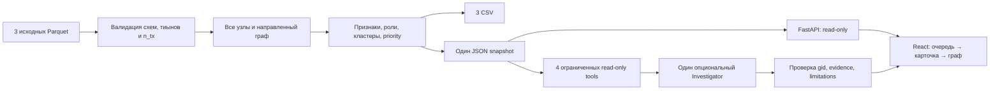

# Демонстрация: 5 минут

Все примеры ниже — рассчитанные узлы исходного кейса. GID здесь служат сценарием показа, не правилами scoring. Snapshot и SHA-256 проверяются по `submission/manifest.json`.

## Запуск

После установки `requirements-lock.txt` в `.venv` и `npm ci && npm run build` в `frontend`:

```powershell
.\.venv\Scripts\python.exe scripts/demo.py --no-ai
```

URL: http://127.0.0.1:8000. CLI получает все три Parquet из `case/data (1)/data`, пишет `pipeline/out/`, затем запускает FastAPI с собранным React. Ошибка расчёта останавливает запуск. Остановить: Ctrl+C. Использовать `--port 8014`, если порт занят; чужой процесс не завершать.

Для явно разрешённой отправки ограниченных facts внешнему OpenAI API: настроить локальное окружение и запустить без `--no-ai`; либо явно указать `--env-file .env`. Ключ не входит в пакет и не требуется для ядра.

## Последовательность

| Время | Действие | Что доказать |
|---|---|---|
| 0:00–0:40 | Запуск, сводка 2248/3119/4840, 35 компонент, 19 изолятов | исходные данные → рабочие выгрузки за <5 минут |
| 0:40–1:20 | На свежей странице вопрос «Какие узлы наиболее приоритетны для дальнейшей проверки и почему?» | при разрешённом AI видны реальные tools и факты; без AI честный unavailable и рабочая очередь |
| 1:20–2:20 | Найти `100000003115284100` (или нажать его ссылку в finding, если она есть) | 8 отправителей, 15 входящих операций, 2 160 500 KZT; priority 0.922834; роль отдельно, 10 узлов/11 рёбер |
| 2:20–3:10 | Найти `100000002578405100`, затем раскрыть остальных соседей | распределитель со 116 получателями; другая weak component из 270 узлов; hidden count честный |
| 3:10–4:00 | Найти `100000000018102100` | depth=4, peripheral; нулевой выход не доказывает terminal |
| 4:00–5:00 | Произвольный gid жюри, экспорт трёх CSV, ограничения | полный dataset доступен поиском; результаты можно проверить вне UI |

Точный вопрос по узлу: «Что известно об узле 100000003115284100 и какие признаки поддерживают его приоритет?»

Резервный изолят: `100000000456947100` — 0 связей, полная карточка, priority 0 как пробел наблюдения. Неизвестный: `999999999999999999` → ENTITY_NOT_FOUND. Для нового глобального вопроса без selected gid обновить страницу.

AI failure/timeout: не повторять бесконечно; перейти к карточке, шести числовым вкладам priority, связям и CSV. Completed не означает доказанную виновность; свободный текст не полностью проверяем, числовые facts проверяются по snapshot. Путь не доказывает хронологию или происхождение тех же средств.

## Резерв без пересчёта и Node

`submission/backup.zip` содержит только проверенные `pipeline/out/` и `frontend/dist/`. Отдельные три CSV находятся в `submission/`. На машине с установленными Python-зависимостями из корня ЭТОГО checkout:

```powershell
.\.venv\Scripts\python.exe -m zipfile -e submission/backup.zip .
.\.venv\Scripts\python.exe scripts/demo.py --skip-pipeline --no-ai
```

Распаковка восстанавливает проверенные выходы и UI; локальные ранее рассчитанные выходы с этими именами будут заменены. Для другой версии исходных данных выполнить полный pipeline. Не выдавать backup за новый расчёт или AI-ответ. Offline backup не содержит модельных ответов, ключей или зависимостей.

## Схема решения



Нет ground truth, оценки виновности, остатков и полного inflow; охват — июль 2026, один банк, ≥5000 KZT, исходящий обход до depth=4. Масштабирование до ~1 млн узлов описано в README и не реализовано в MVP.
